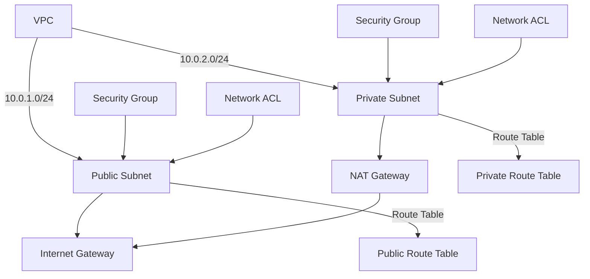

Here is the list of AWS CLI commands used in chapter 5, in the order they were used. Each command includes comments to explain its purpose and any placeholders that need to be replaced with your own account information.

---

### **AWS CLI Commands Used in This Chapter**

#### **Creating a VPC**
```sh
aws ec2 create-vpc \
    --cidr-block 10.0.0.0/16 \
    --tag-specifications 'ResourceType=vpc,Tags=[{Key=Name,Value=SecureInfraVPC}]'
```
> This command creates a VPC with a CIDR block of 10.0.0.0/16.  
> **Replace values as needed for your region and CIDR block.**  
> **Take note of the VPC ID from the output. You will need it later.**

---

#### **Creating a Public Subnet**
```sh
aws ec2 create-subnet \
    --vpc-id <your-vpc-id> \
    --cidr-block 10.0.1.0/24 \
    --availability-zone us-west-2a \
    --tag-specifications 'ResourceType=subnet,Tags=[{Key=Name,Value=PublicSubnet}]'
```
> Creates a public subnet within the VPC.  
> **Replace `<your-vpc-id>` with the VPC ID from the previous step.**  
> **Take note of the Subnet ID.**

---

#### **Creating a Private Subnet**
```sh
aws ec2 create-subnet \
    --vpc-id <your-vpc-id> \
    --cidr-block 10.0.2.0/24 \
    --availability-zone us-west-2b \
    --tag-specifications 'ResourceType=subnet,Tags=[{Key=Name,Value=PrivateSubnet}]'
```
> Creates a private subnet within the VPC.  
> **Replace `<your-vpc-id>` with your actual VPC ID.**  
> **Take note of the Subnet ID.**

---

#### **Creating an Internet Gateway**
```sh
aws ec2 create-internet-gateway \
    --tag-specifications 'ResourceType=internet-gateway,Tags=[{Key=Name,Value=SecureInfraIGW}]'
```
> Creates an Internet Gateway for external internet access.  
> **Take note of the Internet Gateway ID.**

---

#### **Attaching the Internet Gateway to the VPC**
```sh
aws ec2 attach-internet-gateway \
    --vpc-id <your-vpc-id> \
    --internet-gateway-id <your-internet-gateway-id>
```
> Attaches the Internet Gateway to the VPC.  
> **Replace `<your-vpc-id>` and `<your-internet-gateway-id>` accordingly.**

---

#### **Creating a Route Table for the Public Subnet**
```sh
aws ec2 create-route-table \
    --vpc-id <your-vpc-id> \
    --tag-specifications 'ResourceType=route-table,Tags=[{Key=Name,Value=PublicRT}]'
```
> Creates a route table for the public subnet.  
> **Take note of the Route Table ID.**

---

#### **Adding a Route to the Internet Gateway**
```sh
aws ec2 create-route \
    --route-table-id <your-route-table-id> \
    --destination-cidr-block 0.0.0.0/0 \
    --gateway-id <your-internet-gateway-id>
```
> Allows public traffic to flow through the Internet Gateway.  
> **Replace `<your-route-table-id>` and `<your-internet-gateway-id>` accordingly.**

---

#### **Associating the Route Table with the Public Subnet**
```sh
aws ec2 associate-route-table \
    --route-table-id <your-route-table-id> \
    --subnet-id <your-public-subnet-id>
```
> Associates the public route table with the public subnet.  
> **Replace `<your-route-table-id>` and `<your-public-subnet-id>` accordingly.**

---

#### **Creating a NAT Gateway**
```sh
aws ec2 allocate-address \
    --domain vpc \
    --tag-specifications 'ResourceType=elastic-ip,Tags=[{Key=Name,Value=NATGW-EIP}]'
```
```sh
aws ec2 create-nat-gateway \
    --subnet-id <your-public-subnet-id> \
    --allocation-id <your-elastic-ip-allocation-id> \
    --tag-specifications 'ResourceType=natgateway,Tags=[{Key=Name,Value=SecureInfraNATGW}]'
```
> Allocates an Elastic IP and creates a NAT Gateway.  
> **Replace `<your-public-subnet-id>` and `<your-elastic-ip-allocation-id>` accordingly.**  
> **Take note of the NAT Gateway ID.**

---

#### **Creating a Route Table for the Private Subnet**
```sh
aws ec2 create-route-table \
    --vpc-id <your-vpc-id> \
    --tag-specifications 'ResourceType=route-table,Tags=[{Key=Name,Value=PrivateRT}]'
```
> Creates a private route table.  
> **Take note of the Route Table ID.**

---

#### **Adding a Route to the NAT Gateway**
```sh
aws ec2 create-route \
    --route-table-id <your-private-route-table-id> \
    --destination-cidr-block 0.0.0.0/0 \
    --nat-gateway-id <your-nat-gateway-id>
```
> Routes traffic from the private subnet through the NAT Gateway.  
> **Replace `<your-private-route-table-id>` and `<your-nat-gateway-id>` accordingly.**

---

#### **Creating Security Groups**
```sh
aws ec2 create-security-group \
    --group-name InfraTestSG \
    --description "Security group for infrastructure testing" \
    --vpc-id <your-vpc-id> \
    --tag-specifications 'ResourceType=security-group,Tags=[{Key=Name,Value=InfraTestSG}]'
```
> Creates a security group.  
> **Take note of the Security Group ID.**

---

#### **Adding Security Group Rules**
```sh
aws ec2 authorize-security-group-ingress \
    --group-id <your-security-group-id> \
    --protocol tcp \
    --port 443 \
    --cidr 0.0.0.0/0
```
> Allows inbound HTTPS (port 443) access.  
> **Replace `<your-security-group-id>` accordingly.**

---

#### **Creating a Network ACL**
```sh
aws ec2 create-network-acl \
    --vpc-id <your-vpc-id> \
    --tag-specifications 'ResourceType=network-acl,Tags=[{Key=Name,Value=PublicSubnetNACL}]'
```
> Creates a Network ACL for the public subnet.  
> **Take note of the Network ACL ID.**

---

### **Resources Created in This Chapter**
- **VPC** (`vpc-xxxxxxxx`)
- **Public Subnet** (`subnet-xxxxxxxx`)
- **Private Subnet** (`subnet-xxxxxxxx`)
- **Internet Gateway** (`igw-xxxxxxxx`)
- **Public Route Table** (`rtb-xxxxxxxx`)
- **Private Route Table** (`rtb-xxxxxxxx`)
- **NAT Gateway** (`nat-xxxxxxxx`)
- **Elastic IP** (`eipalloc-xxxxxxxx`)
- **Security Groups** (`sg-xxxxxxxx`)
- **Network ACLs** (`acl-xxxxxxxx`)

---

### **Mermaid Diagram of the Architecture**
Here’s a Mermaid diagram to visualize the architecture:


