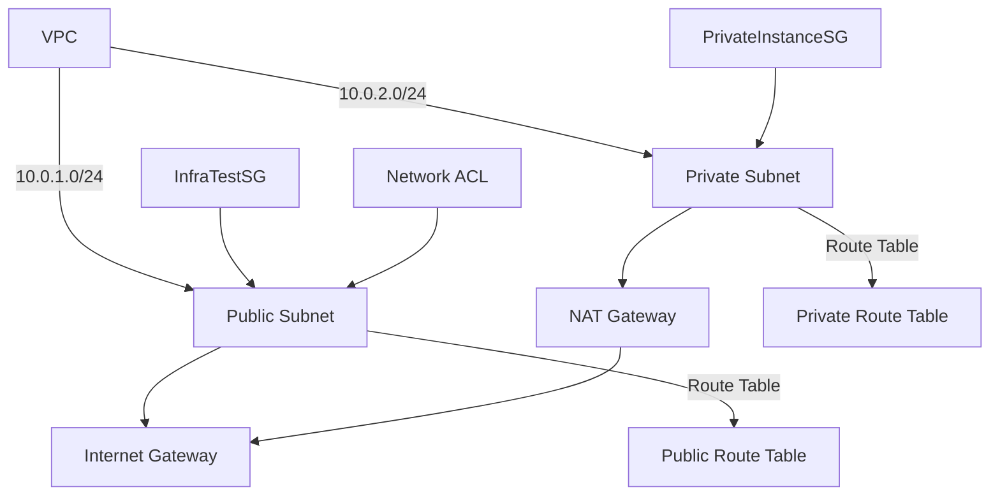

# AWS CLI Commands Used in Chapter 5

## 1. Create a VPC
```sh
aws ec2 create-vpc \
    --cidr-block 10.0.0.0/16 \
    --tag-specifications 'ResourceType=vpc,Tags=[{Key=Name,Value=SecureInfraVPC}]'
```
> **Note:** Record the VPC ID.

## 2. Create a Public Subnet
```sh
aws ec2 create-subnet \
    --vpc-id <your-vpc-id> \
    --cidr-block 10.0.1.0/24 \
    --availability-zone us-west-2a \
    --tag-specifications 'ResourceType=subnet,Tags=[{Key=Name,Value=PublicSubnet}]'
```
> **Replace:** `<your-vpc-id>`  
> **Note:** Record the Public Subnet ID.

## 3. Create a Private Subnet
```sh
aws ec2 create-subnet \
    --vpc-id <your-vpc-id> \
    --cidr-block 10.0.2.0/24 \
    --availability-zone us-west-2b \
    --tag-specifications 'ResourceType=subnet,Tags=[{Key=Name,Value=PrivateSubnet}]'
```
> **Replace:** `<your-vpc-id>`  
> **Note:** Record the Private Subnet ID.

## 4. Create an Internet Gateway
```sh
aws ec2 create-internet-gateway \
    --tag-specifications 'ResourceType=internet-gateway,Tags=[{Key=Name,Value=SecureInfraIGW}]'
```
> **Note:** Record the Internet Gateway ID.

## 5. Attach the Internet Gateway to the VPC
```sh
aws ec2 attach-internet-gateway \
    --vpc-id <your-vpc-id> \
    --internet-gateway-id <your-internet-gateway-id>
```
> **Replace:** `<your-vpc-id>` and `<your-internet-gateway-id>`

## 6. Create a Route Table for the Public Subnet
```sh
aws ec2 create-route-table \
    --vpc-id <your-vpc-id> \
    --tag-specifications 'ResourceType=route-table,Tags=[{Key=Name,Value=PublicRT}]'
```
> **Replace:** `<your-vpc-id>`  
> **Note:** Record the Public Route Table ID.

## 7. Add a Route to the Internet Gateway
```sh
aws ec2 create-route \
    --route-table-id <your-public-rtb-id> \
    --destination-cidr-block 0.0.0.0/0 \
    --gateway-id <your-internet-gateway-id>
```
> **Replace:** `<your-public-rtb-id>` and `<your-internet-gateway-id>`

## 8. Associate the Route Table with the Public Subnet
```sh
aws ec2 associate-route-table \
    --route-table-id <your-public-rtb-id> \
    --subnet-id <your-public-subnet-id>
```
> **Replace:** `<your-public-rtb-id>` and `<your-public-subnet-id>`

## 9. Allocate an Elastic IP for the NAT Gateway
```sh
aws ec2 allocate-address \
    --domain vpc \
    --tag-specifications 'ResourceType=elastic-ip,Tags=[{Key=Name,Value=NATGW-EIP}]'
```
> **Note:** Record the Elastic IP Allocation ID.

## 10. Create a NAT Gateway
```sh
aws ec2 create-nat-gateway \
    --subnet-id <your-public-subnet-id> \
    --allocation-id <your-elastic-ip-allocation-id> \
    --tag-specifications 'ResourceType=natgateway,Tags=[{Key=Name,Value=SecureInfraNATGW}]'
```
> **Replace:** `<your-public-subnet-id>` and `<your-elastic-ip-allocation-id>`  
> **Note:** Record the NAT Gateway ID.

## 11. Create a Route Table for the Private Subnet
```sh
aws ec2 create-route-table \
    --vpc-id <your-vpc-id> \
    --tag-specifications 'ResourceType=route-table,Tags=[{Key=Name,Value=PrivateRT}]'
```
> **Replace:** `<your-vpc-id>`

## 12. Add a Route to the NAT Gateway
```sh
aws ec2 create-route \
    --route-table-id <your-private-rtb-id> \
    --destination-cidr-block 0.0.0.0/0 \
    --nat-gateway-id <your-nat-gateway-id>
```
> **Replace:** `<your-private-rtb-id>` and `<your-nat-gateway-id>`

## 13. Associate the Route Table with the Private Subnet
```sh
aws ec2 associate-route-table \
    --route-table-id <your-private-rtb-id> \
    --subnet-id <your-private-subnet-id>
```
> **Replace:** `<your-private-rtb-id>` and `<your-private-subnet-id>`

## 14. (Optional) Retrieve the Public Subnet ID
```sh
aws ec2 describe-subnets \
    --filters "Name=tag:Name,Values=PublicSubnet" \
    --query 'Subnets[*].SubnetId' \
    --output text
```

## 15. (Optional) Retrieve the Private Subnet ID
```sh
aws ec2 describe-subnets \
    --filters "Name=tag:Name,Values=PrivateSubnet" \
    --query 'Subnets[*].SubnetId' \
    --output text
```

## 16. Create a Security Group for Infrastructure Testing (InfraTestSG)
```sh
aws ec2 create-security-group \
    --group-name InfraTestSG \
    --description "Security group for infrastructure testing" \
    --vpc-id <your-vpc-id> \
    --tag-specifications 'ResourceType=security-group,Tags=[{Key=Name,Value=InfraTestSG}]'
```
> **Replace:** `<your-vpc-id>`  
> **Note:** Record the InfraTestSG Security Group ID.

## 17. Add Inbound HTTPS Rule to InfraTestSG
```sh
aws ec2 authorize-security-group-ingress \
    --group-id <your-infra-test-sg-id> \
    --protocol tcp \
    --port 443 \
    --cidr 0.0.0.0/0
```
> **Replace:** `<your-infra-test-sg-id>`

## 18. Revoke the Default Outbound Rule from InfraTestSG
```sh
aws ec2 revoke-security-group-egress \
    --group-id <your-infra-test-sg-id> \
    --protocol -1 \
    --port -1 \
    --cidr 0.0.0.0/0
```
> **Replace:** `<your-infra-test-sg-id>`

## 19. Add Outbound HTTPS Rule to InfraTestSG
```sh
aws ec2 authorize-security-group-egress \
    --group-id <your-infra-test-sg-id> \
    --protocol tcp \
    --port 443 \
    --cidr 0.0.0.0/0
```
> **Replace:** `<your-infra-test-sg-id>`

## 20. Create a Security Group for the Private Instance (PrivateInstanceSG)
```sh
aws ec2 create-security-group \
    --group-name PrivateInstanceSG \
    --description "Security group for private instance" \
    --vpc-id <your-vpc-id> \
    --tag-specifications 'ResourceType=security-group,Tags=[{Key=Name,Value=PrivateInstanceSG}]'
```
> **Replace:** `<your-vpc-id>`  
> **Note:** Record the PrivateInstanceSG Security Group ID.

## 21. Add Outbound HTTPS Rule to PrivateInstanceSG
```sh
aws ec2 authorize-security-group-egress \
    --group-id <your-private-instance-sg-id> \
    --protocol tcp \
    --port 443 \
    --cidr 0.0.0.0/0
```
> **Replace:** `<your-private-instance-sg-id>`

## 22. Apply InfraTestSG to the Public Instance
```sh
aws ec2 modify-instance-attribute \
    --instance-id <your-public-instance-id> \
    --groups <your-infra-test-sg-id>
```
> **Replace:** `<your-public-instance-id>` and `<your-infra-test-sg-id>`

## 23. Apply InfraTestSG to the Private Instance
```sh
aws ec2 modify-instance-attribute \
    --instance-id <your-private-instance-id> \
    --groups <your-infra-test-sg-id>
```
> **Replace:** `<your-private-instance-id>` and `<your-infra-test-sg-id>`

## 24. Update the Private Instance to Use PrivateInstanceSG
```sh
aws ec2 modify-instance-attribute \
    --instance-id <your-private-instance-id> \
    --groups <your-private-instance-sg-id>
```
> **Replace:** `<your-private-instance-id>` and `<your-private-instance-sg-id>`

## 25. (Optional) Describe Instances for Verification
```sh
aws ec2 describe-instances \
    --filters "Name=tag:Name,Values=PublicInstance,PrivateInstance" \
    --query 'Reservations[*].Instances[*].[InstanceId,Tags[?Key==`Name`].Value]' \
    --output table
```

## 26. Create a Network ACL for the Public Subnet
```sh
aws ec2 create-network-acl \
    --vpc-id <your-vpc-id> \
    --tag-specifications 'ResourceType=network-acl,Tags=[{Key=Name,Value=PublicSubnetNACL}]'
```
> **Replace:** `<your-vpc-id>`

## 27. Create an Inbound NACL Entry for HTTPS (Rule 100)
```sh
aws ec2 create-network-acl-entry \
    --network-acl-id <your-nacl-id> \
    --rule-number 100 \
    --protocol tcp \
    --port-range From=443,To=443 \
    --cidr-block 0.0.0.0/0 \
    --rule-action allow \
    --ingress
```
> **Replace:** `<your-nacl-id>`

## 28. Create an Inbound NACL Entry for Ephemeral Ports (Rule 140)
```sh
aws ec2 create-network-acl-entry \
    --network-acl-id <your-nacl-id> \
    --rule-number 140 \
    --protocol tcp \
    --port-range From=1024,To=65535 \
    --cidr-block 0.0.0.0/0 \
    --rule-action allow \
    --ingress
```
> **Replace:** `<your-nacl-id>`

## 29. Create an Outbound NACL Entry for HTTPS (Rule 100)
```sh
aws ec2 create-network-acl-entry \
    --network-acl-id <your-nacl-id> \
    --rule-number 100 \
    --protocol tcp \
    --port-range From=443,To=443 \
    --cidr-block 0.0.0.0/0 \
    --rule-action allow \
    --egress
```
> **Replace:** `<your-nacl-id>`

## 30. Create an Outbound NACL Entry for Ephemeral Ports (Rule 140)
```sh
aws ec2 create-network-acl-entry \
    --network-acl-id <your-nacl-id> \
    --rule-number 140 \
    --protocol tcp \
    --port-range From=1024,To=65535 \
    --cidr-block 0.0.0.0/0 \
    --rule-action allow \
    --egress
```
> **Replace:** `<your-nacl-id>`

## 31. Retrieve the Current Network ACL Association for the Public Subnet
```sh
aws ec2 describe-network-acls \
    --filters "Name=association.subnet-id,Values=<your-public-subnet-id>" \
    --query 'NetworkAcls[*].Associations[?SubnetId==`<your-public-subnet-id>`].NetworkAclAssociationId' \
    --output text
```
> **Replace:** `<your-public-subnet-id>`

## 32. Replace the Network ACL Association
```sh
aws ec2 replace-network-acl-association \
    --association-id <current-association-id> \
    --network-acl-id <your-nacl-id>
```
> **Replace:** `<current-association-id>` and `<your-nacl-id>`

## 33. Test Connectivity from the Public Instance (HTTPS)
```sh
curl https://checkip.amazonaws.com
```

## 34. Test Connectivity from the Public Instance (HTTP – Expected to Fail)
```sh
curl http://checkip.amazonaws.com
```

## 35. Test Connectivity from the Private Instance (HTTPS)
```sh
curl https://checkip.amazonaws.com
```

## 36. Test Connectivity from the Private Instance (HTTP – Expected to Fail)
```sh
curl http://checkip.amazonaws.com
```

---

# Resources Created in This Chapter

- **VPC:** `vpc-xxxxxxxx`
- **Public Subnet:** `subnet-xxxxxxxx`
- **Private Subnet:** `subnet-xxxxxxxx`
- **Internet Gateway:** `igw-xxxxxxxx`
- **Public Route Table:** `rtb-xxxxxxxx`
- **Private Route Table:** `rtb-xxxxxxxx`
- **NAT Gateway:** `nat-xxxxxxxx`
- **Elastic IP:** `eipalloc-xxxxxxxx`
- **Security Groups:** `sg-xxxxxxxx` (InfraTestSG, PrivateInstanceSG)
- **Network ACL:** `acl-xxxxxxxx`

---

# Architecture Diagram


